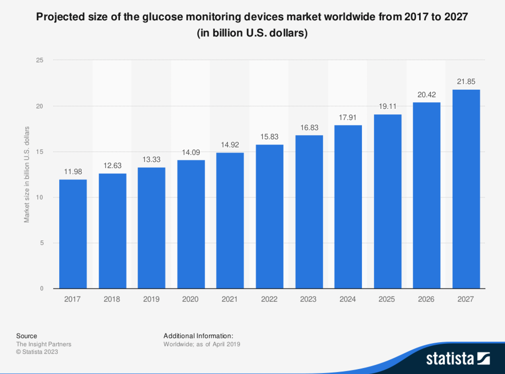
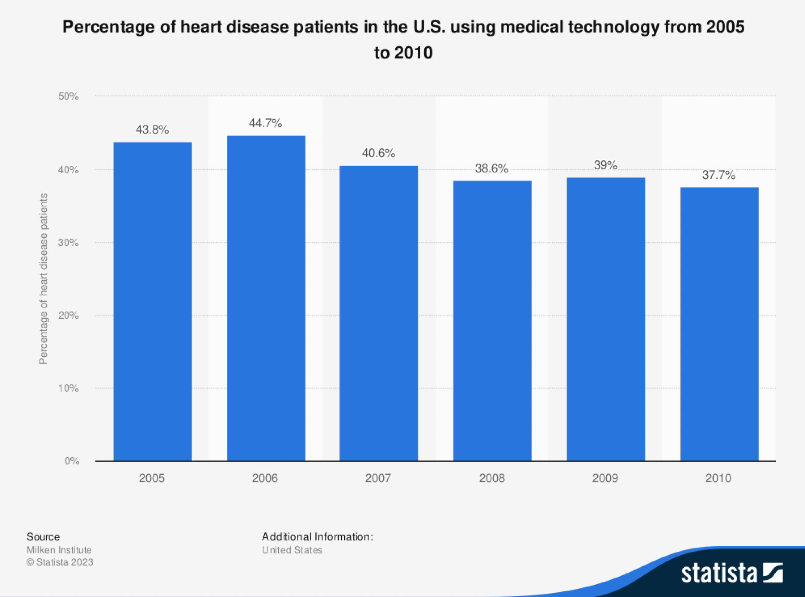
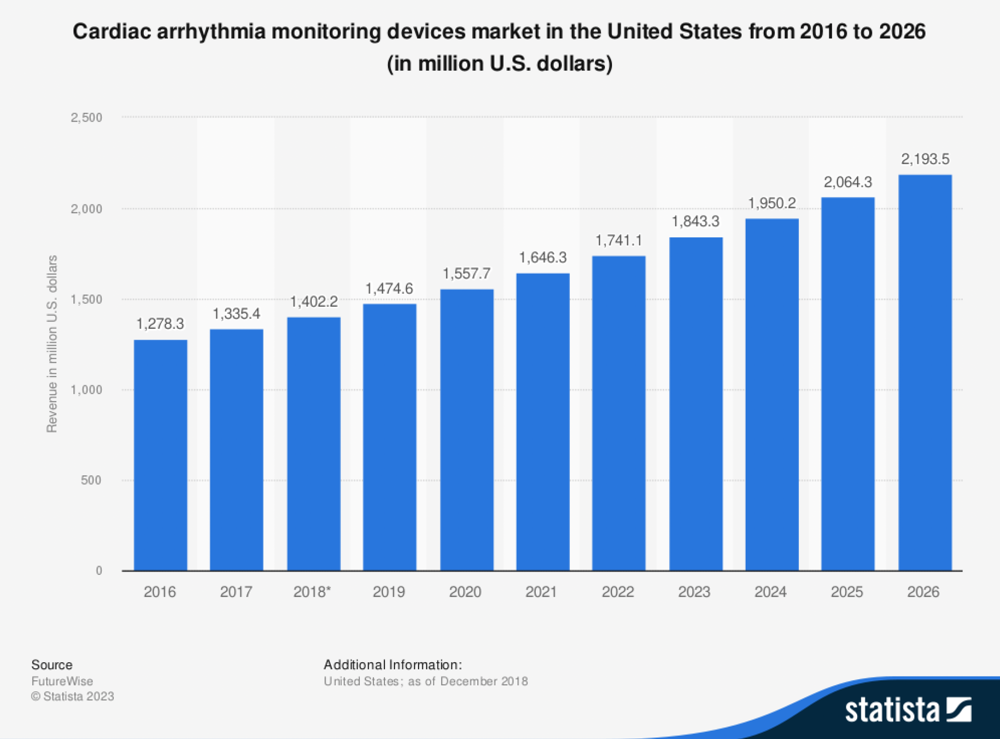
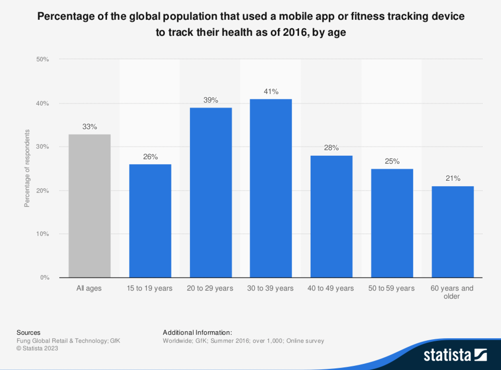

```{r setup, include=FALSE}
knitr::opts_chunk$set(echo = TRUE)
library(ggplot2)
library(diffusion)
library(readxl)
library(ggpubr)
```

&nbsp;&nbsp; In today's world, many start-ups create new technologies that have a high potential to perform well in the market. Because of the lack of historical data, estimating sales and market potential becomes a challenging task. In situations like this using the bass diffusion model along with look-alike analysis can help businesses to estimate the potential of the product at the first stages of the development.
<br> 
<br>

**Innovation**
\
&nbsp;&nbsp;&nbsp; The aim of this short research is to perform a look-alike analysis with the bass diffusion model to understand the possible behavior of new products in the market. For this research was selected a personal medical device called “Bioheart”.
Bioheart by Biotricity is a continuous heart monitoring device that works alongside a mobile application and helps users to constantly monitor their heart rate.
<br>
<br>


 &nbsp;&nbsp;&nbsp; Chosen product has a high potential for growth, since the healthcare industry is getting bigger every year, and the number of people who monitor their health condition is also rising. This device will be used both by patients who need to monitor their condition constantly, as well as by health and sports enthusiasts who take care of their bodies. There are some products in the market that provide similar data to the users such as various smartwatches, however, as various research has shown, wrist wearable devices give a rough estimate of heart rate, often time with noticeable errors. There are various products in the healthcare industry that monitor heart rate, but most of them are highly professional products used mainly by doctors and are not suitable for ordinary users.
\
<br>
<br>

**Looks-alike Product**
\
&nbsp;&nbsp;&nbsp; For the looks-alike product, I chose continuous glucose monitors. Continuous glucose monitor or in short CGM is used to constantly monitor the blood sugar levels of the user.  The choice of this product is justified by two factors. The first factor is that CGM is a specialized healthcare product for specific types of patients that provide 24/7 information to the user, just like CHM does. The second factor was the growing interest of young adults, who do not specifically suffer from the disease, towards healthcare monitors. There is a growing trend among young adults trying to maintain a healthy lifestyle, to use various digital health monitors, in order to optimize their eating habits and sports life. CGM is already being used by millions of people who do not suffer from diabetes, and I think that CHM has the potential to be used by people maintaining a healthy lifestyle and not only by people with cardiovascular disease. 


<center>



</center>

\begin{center}
[Figure 1]
\end{center}

 &nbsp;&nbsp;&nbsp;As we can see from the above graph the CGM market is growing and still didn’t reach its market potential. In the next parts of this paper, we will see that overall digital health devices are getting more popular each year.

\
**Bass model estimation for a continuous glucose monitors.**
\

 &nbsp;&nbsp;&nbsp;For the Bass model estimation, I chose one of the leading companies in the CGM market. Dexcom was established in 1999 and launched its first sensor product in 2004, since then Dexcom has been constantly updating its CGMs. The latest CGM released by Dexcom is Dexcom G6. Since I didn’t find data on sold units of the mentioned product I estimated it with the data of revenue of Dexcom company. Since the company is selling only CGMs and related products (such as patches for CGMs) I considered the price range of CGMs. The average price of CGM is around 380 \$, some people are getting it at a lower price, but the difference is covered by insurance companies, which is why I chose 380 \$ as a price estimate and computed the number of sold products.

```{r, echo = FALSE}
data<- read_xlsx("DexComRevenue.xlsx", sheet = 2)
data<-data.frame(data)
colnames(data) <- c("year", "annual_revenue")
data$cgm_unit_sold_estimate <- data$annual_revenue*1000000/400
data
```
\
**Bass Model Parameters**
\
```{r, echo = FALSE}
diffusion_estimate <- diffusion(data$cgm_unit_sold_estimate)
p_estimate <- as.numeric(diffusion_estimate$w[1])
q_estimate <- as.numeric(diffusion_estimate$w[2])
m_estimate <- as.numeric(diffusion_estimate$w[3])
diffusion_estimate
```


```{r, echo=FALSE}
bass.f <- function(t,p,q){
  ((p+q)^2/p)*exp(-(p+q)*t)/
    (1+(q/p)*exp(-(p+q)*t))^2}
```

```{r, echo=FALSE}
bass.F <- function(t,p,q){
  (1-exp(-(p+q)*t))/
    (1+(q/p)*exp(-(p+q)*t)) }
```

```{r, echo = FALSE, fig.height=5, fig.width=15}
cum_ad<-ggplot(data.frame(t = c(1, 14)), aes(t)) +
stat_function(fun = bass.F, args = c(p=p_estimate, q=q_estimate)) + 
  labs(title = 'Cumalative adaptions for the DexCam CGM')
cum_ad
```

\begin{center}
[Figure 2]
\end{center}

```{r,echo = FALSE,  fig.height=5, fig.width=15}
time_ad<-ggplot(data.frame(t = c(1, 14)), aes(t)) +
stat_function(fun = bass.f, args = c(p=p_estimate, q=q_estimate)) + 
  labs(title = 'The DexCam CGM adoptions at time t')
time_ad
```
\begin{center}
[Figure 3]
\end{center}
```{r, echo = FALSE}
ggarrange(cum_ad, time_ad)
```

\begin{center}
[Figure 4]
\end{center}

<br>
<br> 
 &nbsp;&nbsp;&nbsp; With the Bass model coefficients p(coefficient of innovation) and q(coefficient of imitation) were estimated. In order to estimate potential sales of the Bioheart CHM, first I will try to estimate the potential market size of the product. 
 

\begin{center}
[Figure 5]
\end{center}

<br>
&nbsp;&nbsp;&nbsp;As we can see from the above graph approximately 40 percent of patients with heart disease use various medical technologies.

&nbsp;&nbsp;&nbsp; As we have already discussed main group of users of CHM will be people with cardiovascular disease. More specifically people with cardiac arrhythmia condition need to monitor their heart rate constantly. The below graph represents cardiac arrhythmia monitoring devices ' market revenue for multiple years.  


\begin{center}
[Figure 6]
\end{center}

<br>

&nbsp;&nbsp;&nbsp; With the help of the provided statistics and using some rough approximations, we can try to derive a reasonable market size for our product in the US. 
As suggested by American Heart Association around 82.6 million people in the United States have cardiovascular disease. From Figure X we saw that approximately 40 %  of patients with heart disease use medical devices in the US, we will use this number to make an estimation. From above mentioned facts we assume that 33.04 million people in the US with various cardiovascular diseases are part of our market.
Next, we will consider people with active lifestyles. According to the Bureau of Labor Statistics in 2019 nearly 19% of the US population engaged in sports on a daily basis.The us population is around 330 million people, which means that 62.7 million people are engaged in sports in the US.


\begin{center}
[Figure 7]
\end{center}
 Another statistic retrieved from the Statista website suggests that 33 percent of the population uses various tracking devices and apps to track their fitness activity. Using this number we will assume that 20.7 million people in the US track their activity with various devices. 
Combining two main focus groups of our product we came up with a potential market size of 53,74 million people.


```{r, echo = FALSE}
data$number_of_adopters = bass.f(1:14, p = p_estimate, q = q_estimate)* 53740000
data
```


```{r, echo = FALSE}
innovation_diffusion_estimate<-diffusion(data$number_of_adopters)
p_estimate_innovation <- as.numeric(innovation_diffusion_estimate$w[1])
q_estimate_innovation <- as.numeric(innovation_diffusion_estimate$w[2])
m_estimate_innovation <- as.numeric(innovation_diffusion_estimate$w[3])
innovation_diffusion_estimate
```


```{r, echo = FALSE}
time_ad<-ggplot(data.frame(t = c(1, 14)), aes(t)) +
stat_function(fun = bass.f, args = c(p=p_estimate_innovation, q=q_estimate_innovation)) + 
  labs(title = 'CHM number of addopters at time t')
time_ad
```
\begin{center}
[Figure 8]
\end{center}


\newpage
## References
[1] https://www.dexcom.com/global

[2] https://bioheart.com

[3] https://www.statista.com/topics/1749/physical-activity/#topicOverview

[4] https://secure.macrotrends.net/stocks/charts/DXCM/dexcom/income-statement 

[5] https://www.ncbi.nlm.nih.gov/books/NBK83160/  

[6] https://www.ncbi.nlm.nih.gov/books/NBK83160/

[7] https://www.statista.com/statistics/742448/global-fitness-tracking-and-technology-by-age/

[8] https://www.statista.com/statistics/992022/cardiac-arrhythmia-monitoring-devices-us-market-revenue-forecast/ 

[9] https://www.statista.com/statistics/319416/heart-disease-patients-in-the-us-using-technology/

[10] https://www.statista.com/statistics/1009408/worldwide-glucose-monitoring-devices-market-size/

